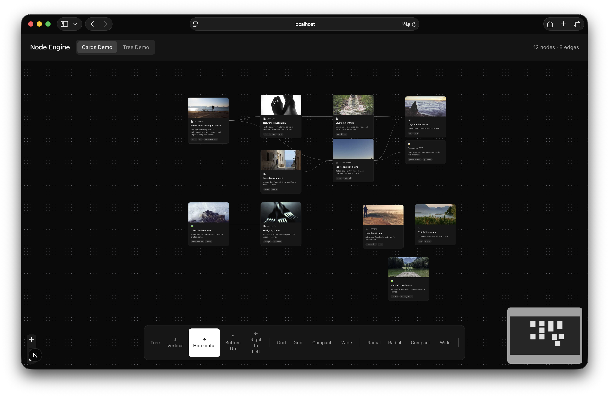

# Flow

An extendable node-based visualization engine built with React Flow and Next.js.



## Features

- **Multiple Layout Algorithms** - Dagre (hierarchical tree), Grid, and Radial layouts
- **10 Layout Presets** - Quick switching between arrangements (vertical, horizontal, compact, wide, etc.)
- **3 Node Components** - BaseNode, CardNode (with thumbnails), and MinimalNode
- **Fully Typed** - Complete TypeScript definitions
- **Extensible** - Easy to add custom node types, edge types, and layouts

## Quick Start

```bash
pnpm install
pnpm dev
```

Open [http://localhost:3000](http://localhost:3000) to see the demo.

## Usage

```tsx
import { NodeEngine, LAYOUT_PRESETS } from "@/engine";

const nodes = [
  { id: "1", type: "card", position: { x: 0, y: 0 }, data: { label: "Node 1" } },
  { id: "2", type: "card", position: { x: 0, y: 0 }, data: { label: "Node 2" } },
];

const edges = [
  { id: "e1-2", source: "1", target: "2" },
];

export default function App() {
  return (
    <NodeEngine
      nodes={nodes}
      edges={edges}
      layout="treeHorizontal"
      onNodeClick={(node) => console.log(node)}
    />
  );
}
```

## Layout Presets

| Category | Presets |
|----------|---------|
| **Tree** | `treeVertical`, `treeHorizontal`, `treeBottomUp`, `treeRightToLeft` |
| **Grid** | `grid`, `gridCompact`, `gridWide` |
| **Radial** | `radial`, `radialCompact`, `radialWide` |

## Project Structure

```
engine/
├── components/     # Node components & main engine
├── layouts/        # Layout algorithms (dagre, grid, radial)
├── hooks/          # useLayout hook
├── types/          # TypeScript definitions
├── constants/      # Layout presets & config
└── utils/          # Helper functions
```

## Tech Stack

- [Next.js 16](https://nextjs.org/)
- [React Flow](https://reactflow.dev/)
- [Dagre](https://github.com/dagrejs/dagre) (graph layout)
- [Tailwind CSS](https://tailwindcss.com/)
- [TypeScript](https://www.typescriptlang.org/)

## License

MIT
